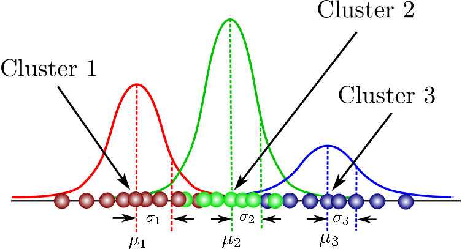

# Background Extraction from videos using Gaussian Mixture Models
***
### Basics of Images and Videos
An image can be digitally represented as a function of space as shown below:
***I = f(x, y)***
*where **x** and ** y** are points is space and **I** represents the intensity. **f** is a mapping of points in space to the corresponding intensity values.*

As shown in the figure below, each point on the image is mapped to an intensity value which is the color that we see at that particular point.

 

For an 8-bit encoded image, intensity levels can have 2 ^ 8 values, i.e, from 0-255. 
For a grayscale image, **I** can have values in the range [0, 255]
For a color image, each point in space takes 3 values in the range [0, 255] for the 3 color channels, R, G and B. 
***

A video on the other hand varies both in space and time as shown in the equation below:
***V = f(x, y, t)***
*where **x** and **y** are points is space, **t** represents time and **V** represents the intensity. **f** is a mapping of points in space and time to the corresponding intensity values.*

As shown in the video below, the intensity at a point (on the road) not only is a function of the x and y cordinates of that point but is also a function of time. It is time that determines whether the intensity value is contributed by a vehicle or by the road.

 

***
### Gaussian Mixture Modelling (GMM)
Gaussian Mixture Modelling is the method of modelling data as a weighted sum of Gaussians. 

GMMs are widely used to cluster data, where each point in the n-dimensional feature space gets associated with each of the clusters with a certain probability, unlike in k-means clustering, where a point in the feature space gets associated with only a single cluster, 

Each of these clusters are parameterized by the cluster mean (μ), the covarianves (Σ) and weights (π) as shown below:

Couple of recommended articles on Gaussian Mixture Modelling are provided in the reference section. It is recommended to read those articles to gain better understanding of how we will leverage GMMs for background modelling.

***

### Background Modelling
Background modelling is the task of extracting the static background from a sequence of video frames. Once the background has been modelled, a technique called background subtraction which allows an image's foreground to be extracted for further processing (object recognition etc.) is generally used. Hence, background modelling forms an integral part of foreground detection and analysis.

As shown in the video below, the background consists of the road which gets hidden occassionally owing to foreground variations caused by the moving vehicles. 

 

The vehicles constitutes the foreground here and their dynamic nature accounts for the variation in intensity levels of points on the road.
The end result of this exercise would be an image (frame) where there will be no vehicles, i.e, an image devoid of the dynamic foreground.

We are going to model each point in space for all the three image channels, namely R, G and B as a bimodal distribution of Gaussians, where one Gaussian in the mixture accounts for the background and the other for the foreground.

**Algorithm:**
The step-wise approach is as follows:
1. Extract frames from the video and store them to disc.
2. Load the frames onto memory and stack them in an array where the final array dimensions will be *(num_frames, image_width, image_height, num_channels)*
3. Initialize a dummy background image of the same size as the individual frames.
4. For each point characterized by the x coordinate, the y-coordinate and the channels, model the intensity values as a mixture of two Gaussians.
5. Once modelled, initialize the intensity value at the corresponding location in the dummy background image with the mean of the most wedighted cluster. The most weighted cluster will be the one coming from the background whereas owing to the dynamically changing foreground, the other cluster will be voted less.
6. Finally, the background image will contain the intensity values corresponding to the static background.

**Results:**
The following image is obtained on successful execution of the algorithm described above:

 

Note that the image is devoid of any vehicles.

***

### References:
1. http://statweb.stanford.edu/~tibs/stat315a/LECTURES/em.pdf
2. https://medium.com/clustering-with-gaussian-mixture-model/clustering-with-gaussian-mixture-model-c695b6cd60da
3. Matlab toolbox for the video 'traffic.avi'
