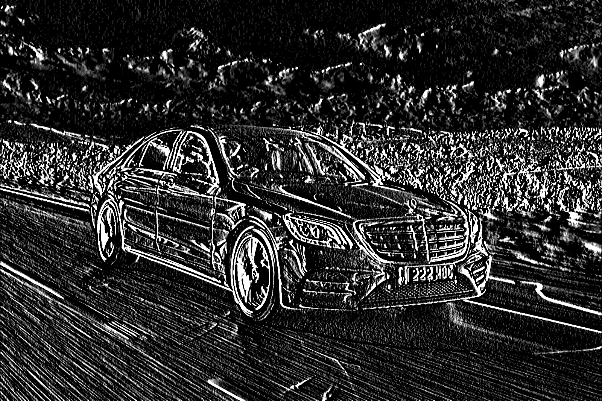
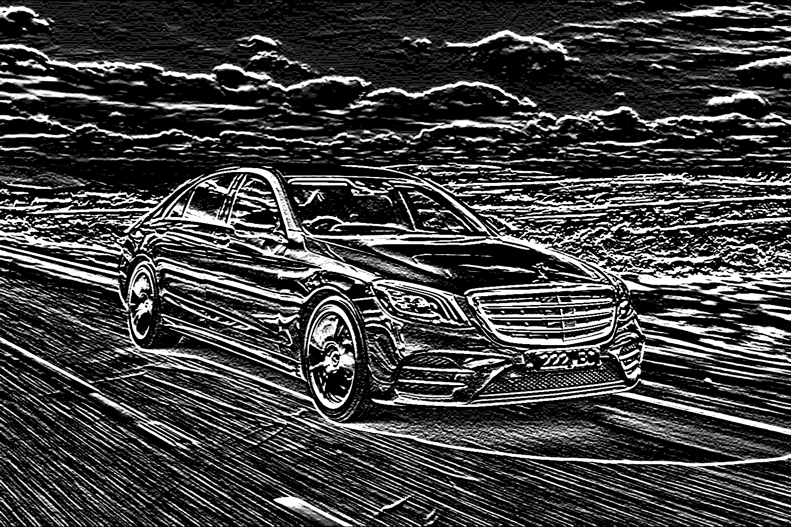
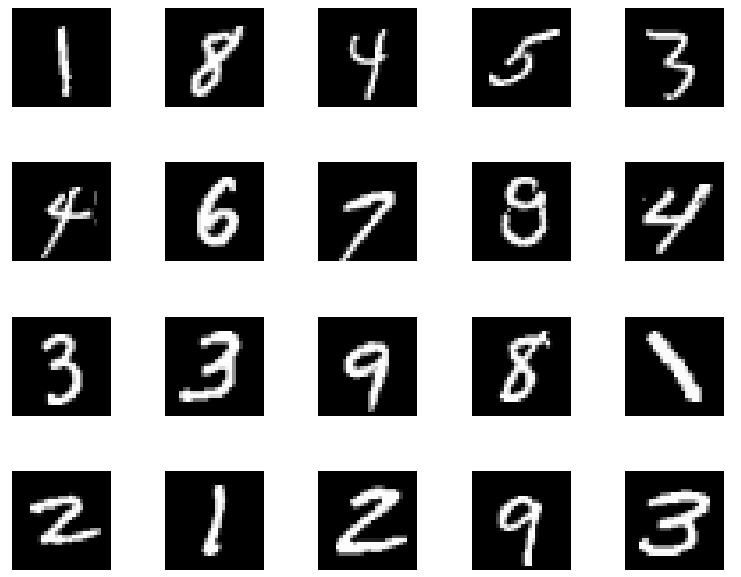
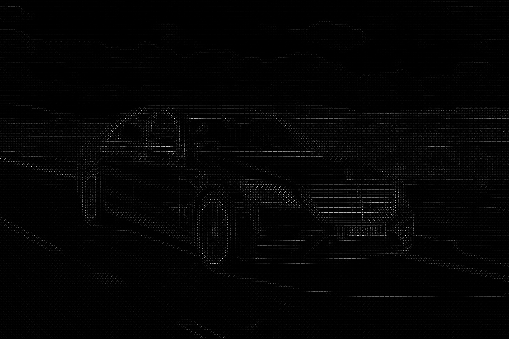
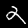
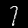
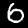
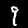

# Training a Neural Network with Histogram of Oriented Gradients (HOG) features

***

### Introduction
With the advent of Convolutional Neural Networks (CNN) and Deep Learning, feature extractors are a part of the training setup where feature extractors are learnt by recursive implementation of chain rule in a fully differential setup.  

Prior to the era of CNNs, feature engineering was an important part of common Computer Vision tasks like image classification and object detection wherein, hand crafted features were used to extract meaningful features from an image.  

A feature descriptor is a representation of the salient features in an image that can help classify the image from others. A good feature descriptor is one that is compact in the sense that it is representative of all the useful information present in the image while discarding others.  

For the sake of simplicity, let us consider the image given below:  

Let us use Sobel derivatives to compute the edges in the x and y directions in the image above. The images below shows the edges in the horizontal and vertical directions as computed by using the Sobel kernel.

| Sobel x  | Sobel y |
| ------------- | ------------- |
|  |   |

Looking at just the edges in the images above, one can still say that the image contains a car.   

In this article we will be computing the Histogram of Oriented Gradients (HOG) features on the MNIST dataset and use them to train a fully connected neural network.  

***
### MNIST Dataset
MNIST Dataset consists of 60000 images of hand written digits from 0-9. It is split into a traning set consisting of 50000 images and a test set consisting of 10000 images. Each image is a grayscale image with a dimension of 28 x 28.  

***

### Histogram of Oriented Gradients (HOG) features
The histogram of oriented gradients (HOG) is a feature descriptor used in computer vision and image processing for the purpose of object detection and image classification. The technique counts occurrences of gradient orientation in localized portions of an image. 

The following image shows the HOG features computed for the image of the car shown above. Note that the direction of the most dominant gradient at each point in the image as shown below captures the shape of the car. For better visibility, the dynamic range of the image has been enhanced.

Couple of articles on computing HOG features are given in the reference section. It is recommended to go through them to gain a thorough understanding on how HOG features are computed for an image or a patch of it.  

For extracting the HOG features from the MNIST dataset, I have used 4x4 pixels per cell to compute more localized features and 3x3 cells per block for the block normalization part. This is reasonable as the image size is small (28x28). However, the intensity variation across the image is limited and hence, block normalization across 3x3 cells doesn't cost us much. This gives rise to a 2025 dimensional feature vector.

***

### Training a Fully Connected Neural Network
A fully connected neural network with hidden layer dimensions of (512, 128) is used for the training. The input layer is of size 2025 owing to the 2025 dimensional HOG feature vector. The output layer consists of 10 neurons corresponding to the digits from 0-9.
ReLU activation function is used for the non-linearity. A learning rate of 0.001 and Adam's optimizer is used for the training. The network is trained for 500 epochs.

***

###Results
A training accuracy of 99.96% and a test accuracy of 98.64% was obtained. The accuracy is pretty good considering the fact that using CNNs, which are more powerful and better suited for images, an accuracy of 99% has been obtained on the MNIST dataset.  
 
Total number of images from the test dataset that were incorrectly classified were 136 out of 10000. 

Few of the incorrectly classified images are as shown below.  

|                                      Image                                          | Actual | Predicted |
| ----------------------------------------------------------------------- |   :---:   |     :---:      |
|  |     2     |        9       |
|  |     7     |        1       |
|  |     4     |        2       |
|  |     6     |        0       |
|  |     9     |        8       |

***

### References
* https://lear.inrialpes.fr/people/triggs/pubs/Dalal-cvpr05.pdf
* https://www.learnopencv.com/histogram-of-oriented-gradients/
* https://en.wikipedia.org/wiki/Histogram_of_oriented_gradients

